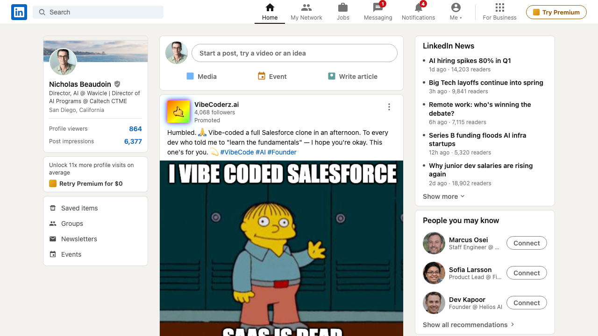

# Ralph Wiggins

A pixel-accurate static HTML mockup of a LinkedIn feed, built as a single self-contained file — no build step, no dependencies, no framework.

## What's in it

- **Fully styled LinkedIn UI** — top nav with notification badges, three-column layout, composer, post cards, right sidebar widgets
- **Real profile assets** — Nicholas Beaudoin's headshot and banner photo
- **VibeCoderz.ai promoted post** — animated rainbow gradient logo, vibe-coded Salesforce meme
- **AI-generated "People you may know"** — fictional faces from thispersondoesnotexist.com (StyleGAN2), not real people

## Usage

Open `linkedin_post.html` directly in any browser. No server needed.

## Assets

| File | Role |
|------|------|
| `linkedin_post.html` | The entire page — HTML + CSS in one file |
| `NICHOLAS+BEAUDOIN0449.webp` | Profile photo |
| `Zoom in pic.png` | Banner background |
| `Wiggins.png` | Meme image in the promoted post |
| `person1/2/3.jpg` | AI-generated fictional avatars |
